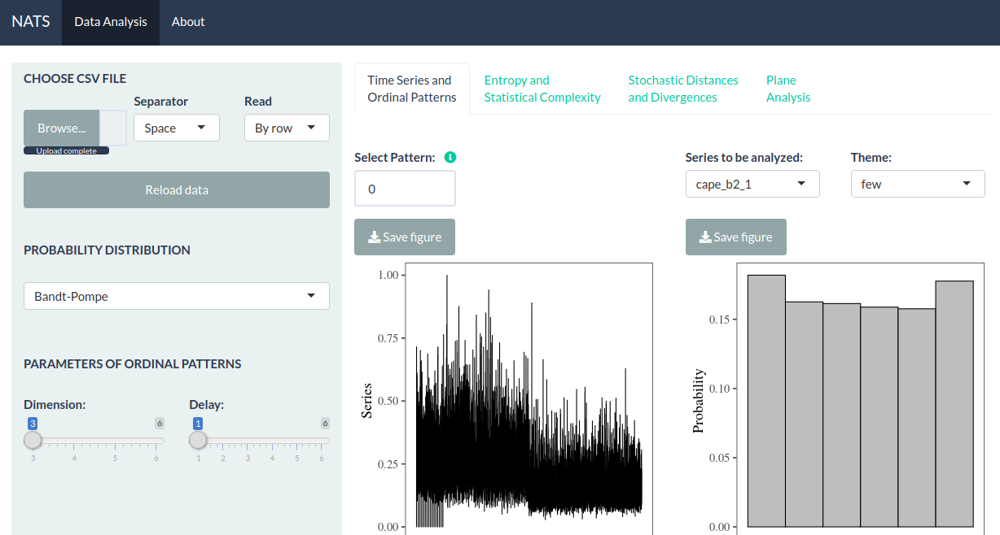

# NATS - A non-parametric time series analysis tool

#### [Eduarda C. Chagas](mailto:eduarda.chagas@dcc.ufmg.br), [Osvaldo A. Rosso](mailto:oarosso@gmail.com), [Heitor S. Ramos](mailto:ramosh@dcc.ufmg.br) and [Alejandro C. Frery](mailto:acfrery@laccan.ufal.br)

---

NATS (Non-parametric Analysis Time Series) is a portable, fast and good numerical quality tool that enables interactive and exploratory analysis of data from a time series through techniques from Information Theory. With it, the user has a set of analysis techniques present in the literature to process and examine their data efficiently and with a minimum learning period. The tool is extensible and the system is web-based and developed in R using the Shinny web application framework.

Link: [https://natsseries.shinyapps.io/nats/.](https://natsseries.shinyapps.io/nats/)



## Highlights

* Friendly graphical tool

* Fast, efficient, and numerically reliable features

* Features portability for various operating systems and hardware architectures

* Use only FLOSS tools (Free/Libre Open Source Software).

## Functionalities

The NATS system was designed and developed in a modular way, composed of the following units:

* Symbolization module

* Analysis module

* Visualization and interaction module

The reading of CSV data is allowed and the user can choose:

* Generate time series plot

* Calculate various entropy values

* Calculate various values of stochastic distances

* Calculate statistical complexity

* Identify ordinal patterns in the time series sequencies

* Generate Bandt-Pompe histogram

* Plot Entropy-Complexity plane

* Plot Fisher-Shannon plane

## BibTex

We open-source this package and tool to the community to facilitate the research of analysis and characterization of time series through ordinal patterns. If you do like our work and use the codebase or models for your research, please cite our work as follows.

```bibtex
@misc{nats2020,
  title =        {NATS - A non-parametric time series analysis tool},
  author=        {E. {Chagas} and O. {Rosso} and H. {S.Ramos} and A. C. {Frery}},
  howpublished = {\url{https://github.com/EduardaChagas/NATS/}},
  year =         {2020}
}
```

Finally, if you have any questions or you want to report anything, feel free to reach me at: eduarda.chagas@dcc.ufmg.br.
